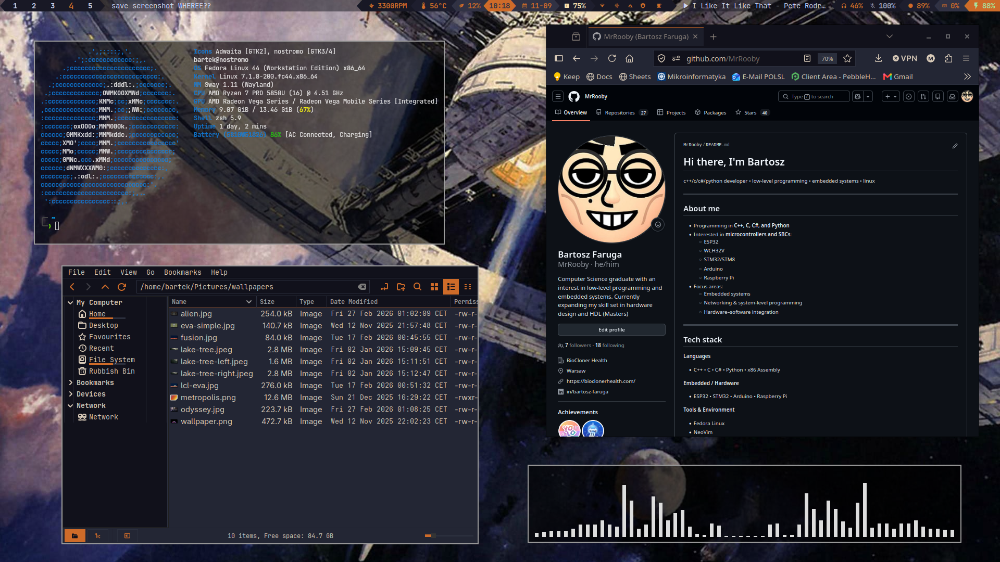
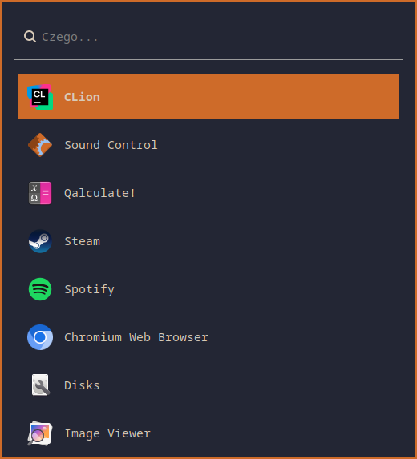
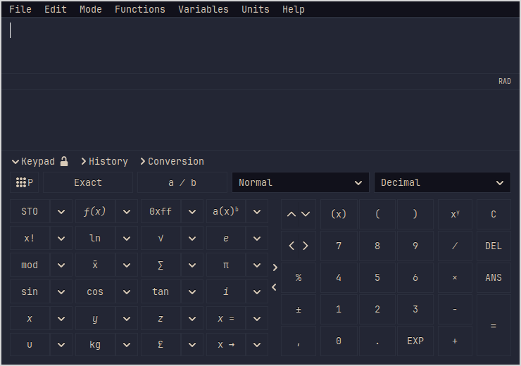
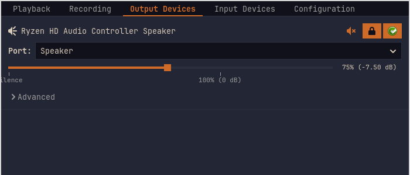
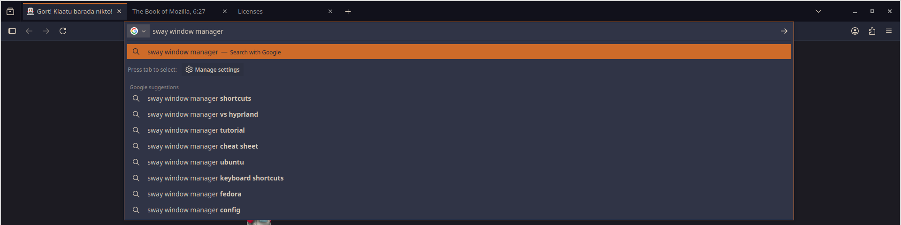
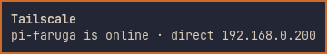

# nostromo

Retro-futuristic Sway theme. Flat, square, orange on navy — bar,
launcher, notifications, GTK apps and Firefox all share one palette.



```bash
git clone https://github.com/MrRooby/dotfiles.git ~/dotfiles
cd ~/dotfiles && ./bootstrap.sh --dry-run && ./bootstrap.sh
```

**Palette** — `#11111b` bar · `#232634` windows · `#d8cab8` text · `#9b9b9b` dim · `#CE6B29` accent

---

## Waybar


Script-backed modules with detailed tooltips — based on [mechabar by sejjy](https://github.com/sejjy/mechabar)

| battery | temperature |
|---|---|
|  |  |
| **cpu** | **bluetooth** · **caffeine** |
|  |  <br>  |

- battery: charge rate, time to full/empty, charger, health, cycles
- temperature: every sensor, grouped, with thermal-limit notifications
- tailscale: every device on the tailnet, online / idle / offline
- power-profile drawer, caffeine (stay awake with the lid shut)
- volume: left-click pavucontrol, right-click mute, scroll to change
- 5 swappable themes — nostromo + 4 Catppuccin flavours


## Wofi



## GTK apps

Every GTK3, GTK4 and libadwaita app, via `gtk-3.0/gtk.css` + `gtk-4.0/gtk.css`.

| Qalculate! | pavucontrol |
|---|---|
|  |  |

## Firefox

`userChrome.css`, overrides any installed theme.



## Notifications

mako, bottom-right.



## Also

- **sway** — no gaps, 2px borders, autotiling
- **kitty** — JetBrainsMono Nerd Font
- **ly** — TTY login
- **hyprlock + hypridle** — lock and idle
- **nostromo** icons, **retro-cursor** cursors, Kvantum for Qt
- **keyd** — keyboard remapping

## Keys

| | |
|---|---|
| <kbd>Super</kbd> <kbd>Enter</kbd> | terminal |
| <kbd>Super</kbd> <kbd>D</kbd> | launcher |
| <kbd>Super</kbd> <kbd>E</kbd> | files |
| <kbd>Super</kbd> <kbd>F</kbd> | Firefox |
| <kbd>Super</kbd> <kbd>Q</kbd> | close |
| <kbd>Super</kbd> <kbd>Shift</kbd> <kbd>Space</kbd> | float |
| <kbd>Super</kbd> <kbd>Shift</kbd> <kbd>F</kbd> | fullscreen |
| <kbd>Super</kbd> <kbd>S</kbd> | screenshot → clipboard |
| <kbd>Super</kbd> <kbd>Shift</kbd> <kbd>S</kbd> | screenshot → file |
| <kbd>Super</kbd> <kbd>Shift</kbd> <kbd>L</kbd> | lock |

---

## BASH scripts

| | When | What it does |
|---|---|---|
| `bootstrap.sh` | **once**, on a new machine | repos → packages → fonts → configs → themes → `/etc` → dconf → services |
| `update_dotfiles` | **day to day** | two-way sync repo ↔ system for the paths in `.tracked_folders` |

`bootstrap.sh` *copies* files rather than symlinking them, so `update_dotfiles`
keeps working normally afterwards.

---

## Stages

All of them can be filtered: `--only configs,themes` or `--skip packages,fonts`.

| Stage | What happens |
|---|---|
| `repos` | enables the COPRs in `packages/copr.txt` (keyd, Hyprland-Fedora) |
| `packages` | `dnf install` of the 44 packages in `packages/dnf.txt` |
| `fonts` | downloads JetBrainsMono Nerd Font from GitHub into `~/.local/share/fonts` |
| `autotiling` | `pip install --user autotiling` |
| `configs` | copies configs into `~/.config`, and the Firefox files into the default profile |
| `themes` | icons → `~/.local/share/icons`, cursors → `~/.icons` |
| `wallpapers` | → `~/Pictures/wallpapers` |
| `system` | `/etc/ly`, `/etc/keyd`, enables `ly` and `keyd`, disables a competing DM |
| `dconf` | loads GTK/icon/cursor theme settings and nemo preferences |
| `caches` | `fc-cache` + `gtk-update-icon-cache` |

---

## What's in here

```
bootstrap.sh          fresh-machine installer
update_dotfiles       day-to-day sync (TUI, needs `gum`)
.tracked_folders      system ↔ repo path map

packages/dnf.txt      package list
packages/copr.txt     COPR repositories

sway/  waybar/  wofi/  kitty/  hypr/  mako/  dunst/  nvim/
gtk-3.0/              nostromo theme for every GTK3 app (gtk.css) + settings.ini
gtk-4.0/              nostromo theme for every GTK4 / libadwaita app + settings.ini
qt6ct/  Kvantum/
firefox/              userChrome.css + user.js, installed into the default profile

icons/nostromo/       icon theme (orange folders)
icons/retro-cursor/   cursors + 120 X11/CSS name aliases
icons/RetroismIcons/  icons for Qt apps
icons/gtk_theme/

wallpapers/           used by sway and hyprpaper
system/ly/            config.ini + startup.sh for the display manager
system/keyd/          keyboard remapping
dconf/                dconf dumps + how to load them
screenshots/          the images in this README
```

---

## Hardware-specific bits

These are the only things you have to touch by hand after moving.

### Monitors

`sway/output.conf.example` came from a laptop (`eDP-1` + `HDMI-A-1`).
Bootstrap **will not overwrite** an existing `~/.config/sway/output.conf`;
if there isn't one it seeds it from the example and warns you.

```bash
swaymsg -t get_outputs        # the real output names
```

Note: the file header says `managed by xwlm, do not edit manually` — if you're
no longer using xwlm you can ignore that and write it by hand.

### Laptop → desktop

The whole config came from a laptop. On a desktop with no battery, remove:

- from `waybar/config.jsonc`: `custom/battery`, `backlight`, `custom/fan`
- from `sway/config`: the `bindswitch --locked lid:on ...` line and the
  `input "type:touchpad"` block

Bootstrap detects the missing battery and prints this at the end.

### Keyboard

`system/keyd/default.conf` maps `102nd` and `nonusbackslash` to `leftshift` —
that's for a specific keyboard (uniCorne). Probably unnecessary otherwise.

### Firefox

The profile folder has a random name on every machine, so bootstrap looks the
default profile up in `profiles.ini` instead. If Firefox has never been started
there is no profile yet — start it once, then run `./bootstrap.sh --only configs`.

`.tracked_folders` still names *this* machine's profile
(`zr1gpgry.default-release`); change it on a new one so `update_dotfiles` syncs
from the right place.

---

## Waybar — read this

`~/.config/waybar` is a separate repo: **github.com/MrRooby/nostromo-waybar**.
What lives in `dotfiles/waybar/` is a *snapshot* of it, not a submodule.

So: if you change something in waybar and don't push it to `nostromo-waybar`,
that change only exists in the snapshot. Before migrating:

```bash
cd ~/.config/waybar && git status      # check for uncommitted work
cd ~/dotfiles && ./update_dotfiles     # only then refresh the snapshot
```

---