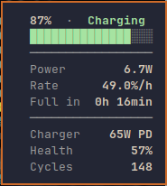
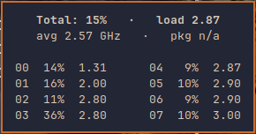
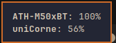
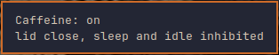
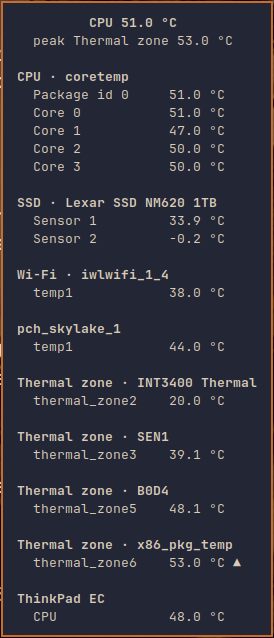

<div align="center">

<h1>nostromo-waybar</h1>

<p><b>A Waybar config for Sway.</b><br>
Powerline islands, a warm industrial palette, and script-backed modules
that say more than the built-ins can.</p>

<p>


</p>


</div>

---

## The bar

Three islands, each a powerline chain of modules separated by wedge dividers.
`fixed-center: true` plus a hand-tuned `custom/center_pad` keeps the centre
island still while the sides change width.

<p align="center">
<br>
<sub><b>Left</b> — workspaces, focused window</sub>
</p>

<p align="center">
<br>
<sub><b>Centre</b> — fan, temperature, CPU, clock, date, memory, network, bluetooth, hotspot, tailscale, caffeine</sub>
</p>

<p align="center">
<br>
<sub><b>Right</b> — media, volume, backlight, keyboard battery, battery</sub>
</p>

### Module map

Everything on the bar, in order. **Script** marks the modules this fork wrote
itself; the rest are Waybar built-ins with a local config.

| Module | Shows | Tooltip | Mouse | Script |
| ------ | ----- | ------- | ----- | ------ |
| `sway/workspaces` | numbered workspaces | — | scroll switches | |
| `sway/window` | focused window title | — | | |
| `custom/fan` | fan RPM | — | | [`fan.sh`](./scripts/fan.sh) |
| `custom/temperature` | CPU °C | every hwmon chip and thermal zone | | [`temperature.sh`](./scripts/temperature.sh) |
| `custom/cpu` | power-profile icon + total % | per-thread usage and clock grid | | [`cpu.sh`](./scripts/cpu.sh) |
| `clock#time` | 24h clock | 12h clock | click cycles the mode | |
| `clock#date` | date | month calendar | | |
| `memory` | RAM % | used / total | | |
| `network` | Wi-Fi strength icon | SSID, address, strength, band | click toggles an `impala` popup | |
| `bluetooth` | adapter state icon | **every connected device with its battery %** | click opens `bluetui`, right-click powers off | |
| `custom/hotspot` | 󱂇 / 󰠅 | NetworkManager hotspot state | click toggles | [`hotspot.sh`](./scripts/hotspot.sh) |
| `custom/tailscale` | 󰦝 / 󰦞 | tailnet address, logged out, or off | click toggles | [`tailscale.sh`](./scripts/tailscale.sh) |
| `custom/caffeine` | 󰅶 / 󰛉 | lid, sleep and idle inhibit state | click toggles | [`caffeine.sh`](./scripts/caffeine.sh) |
| `mpris` | now playing | player and track | click play/pauses, middle previous, right next | |
| `group/pulseaudio` | volume; hover reveals the mic | device and level | click mutes, scroll adjusts | [`volume.sh`](./scripts/volume.sh) |
| `backlight` | brightness % | level | scroll adjusts | [`backlight.sh`](./scripts/backlight.sh) |
| `custom/keyboard` | split-keyboard battery | keyboard battery over Bluetooth | click opens the power panel | [`corne.sh`](./scripts/corne.sh) |
| `group/battery_profile` | battery %; hover reveals three TLP buttons | gauge, watts, %/h, time left, charger, health, cycles | click a button to switch profile | [`battery.sh`](./scripts/battery.sh), [`power-profile.sh`](./scripts/power-profile.sh) |

<details>
<summary>Modules that ship but are not on the bar</summary>

Kept because they are one line away from being useful, and because removing
them would fork further from upstream than necessary.

| Module | Why it is off | 
| ------ | ------------- |
| `custom/distro` | distro logo, no room in the layout |
| `custom/user` | username + uptime |
| `custom/power_menu` | fzf power menu in a `kitty` popup |
| `custom/system_update` | [`system-update.sh`](./scripts/system-update.sh) is still Arch-only |
| `idle_inhibitor` | superseded by `custom/caffeine`, which also covers logind |
| `sway/windowcount` | declares `hyprland/windowcount` — a copy-paste slip |
| `modules/hyprland/*` | the Hyprland counterparts, not included by `config.jsonc` |

</details>

<details>
<summary>Dividers</summary>

The powerline look is not a font feature — every seam is its own module.
[`modules/custom/dividers.jsonc`](./modules/custom/dividers.jsonc) defines
`custom/left_div#N` and `custom/right_div#N`, each a single wedge glyph
coloured by [`styles/modules-*.css`](./styles/) so the fill on one side matches
the module before it and the other side matches the one after. Reordering
modules means renumbering the dividers around them.

</details>

---

## Tooltips

The reason nine modules are script-backed: Waybar's `tooltip-format` takes one
flat format string, so anything needing a grid, a gauge or a computed rate has
to be a `custom/` module that renders its own Pango markup.

<p align="center">

&nbsp;&nbsp;

</p>

<p align="center">

&nbsp;&nbsp;

</p>

<p align="center">
<sub>battery · CPU · bluetooth · caffeine</sub>
</p>

<details>
<summary>Temperature — every sensor the kernel exposes</summary>

<p align="center">

</p>

</details>

<details>
<summary>Power profile drawer</summary>

Hovering the battery slides out three TLP profile buttons. The active one is
inverted, the same treatment `#entry:selected` gets in wofi.

<p align="center">

</p>

</details>

---

## What this fork adds

| | What it does |
| --- | --- |
| **Tooltips that appear on hover** | GTK3 waits 500 ms and has no setting for it. [`tools/fast-tooltip.c`](./tools/fast-tooltip.c) interposes the timer and gets it down to ~70 ms. Measured, not guessed — see [Known issues](#known-issues) for the caveat. |
| **Battery detail** | Charge rate in watts and %/h, time to full or empty, the charger's real USB-PD contract, charge limit, health and cycle count. |
| **Per-thread CPU** | Usage and clock for every thread in a two-column grid, with load average and package watts. |
| **All sensors, discovered** | [`temperature.sh`](./scripts/temperature.sh) walks hwmon and the thermal zones at runtime and learns which pairs are the same physical sensor, because hwmon indices are not stable across boots. |
| **Bluetooth device batteries** | Not just the adapter icon — every connected device with its percentage. |
| **Sleep inhibit** | One click keeps the machine awake with the lid shut, including the lock screen. |
| **Theme-aware tooltips** | [`battery.sh`](./scripts/battery.sh) parses `current-theme.css`, follows `@define-color` chains to a hex and emits Pango spans, so tooltip accents track the active theme instead of being hardcoded. |
| **Fedora installer** | Upstream's is Arch. |

One more that is easy to miss: `"locale": ""` in
[`config.jsonc`](./config.jsonc) is deliberate — it bypasses an async D-Bus
portal check that otherwise costs a 60 s startup hang.

---

## Requirements

> [!WARNING]
> **Install a Nerd Font manually.** Every glyph in the bar is a Nerd Font
> codepoint, but `install.sh` pulls Fedora's `jetbrains-mono-fonts`, which is
> the *unpatched* upstream family. With only that installed the whole bar
> renders as tofu. Grab
> [JetBrainsMono Nerd Font](https://github.com/ryanoasis/nerd-fonts/releases)
> and drop it in `~/.local/share/fonts/`, or point
> [`styles/fonts.css`](./styles/fonts.css) at a patched font you already have.

- **[Waybar](https://github.com/Alexays/Waybar)** — developed against v0.15.0.

  > [!NOTE]
  > v0.14.0 has an [issue](https://github.com/Alexays/Waybar/issues/4354) that
  > breaks the [wildcard includes](./config.jsonc#L2-L9) this config relies on.

- **Sway.** `config.jsonc` includes `modules/sway/*` and uses
  `sway/workspaces` / `sway/window`.
- **A terminal emulator** — `kitty` by default, named directly by the network,
  bluetooth and power-menu popups.

<details>
<summary>Installed by <code>install.sh</code></summary>

| Package | For |
| ------- | --- |
| `bluez`, `bluez-tools` | Bluetooth stack and `bluetoothctl` |
| `brightnessctl` | backlight |
| `fzf` | the menu scripts |
| `NetworkManager` | `nmcli`, network and hotspot |
| `dnf-utils` | update checks |
| `pipewire-pulseaudio` | audio |
| `jetbrains-mono-fonts` | font — see the warning above |
| `gcc`, `glib2-devel`, `pkgconf-pkg-config` | building the fast-tooltip shim |

</details>

<details>
<summary>Runtime dependencies it does <em>not</em> install</summary>

The modules call these directly. A missing one degrades to a placeholder rather
than breaking the bar, but that module stops being useful:

`tlp` (1.9+ with `tlp-pd`, mutually exclusive with `power-profiles-daemon`),
`tailscale`, `upower`, `libnotify` and a notification daemon such as `mako`,
`busctl`, `playerctl`, `wpctl`, and the TUI popups `bluetui`, `impala` and
`wlctl`.

</details>

---

## Install

```bash
mv ~/.config/waybar{,.bak}
git clone https://github.com/MrRooby/nostromo-waybar.git ~/.config/waybar
~/.config/waybar/install.sh
```

Then install a Nerd Font, and start the bar through the wrapper so tooltips
are quick:

```properties
# ~/.config/sway/config
exec ~/.config/waybar/scripts/waybar-run.sh
```

[`waybar-run.sh`](./scripts/waybar-run.sh) builds
[`tools/fast-tooltip.c`](./tools/fast-tooltip.c) into `lib/` the first time it
runs and preloads it. If the compiler or the glib headers are missing it just
starts Waybar unmodified.

<details>
<summary>Repository layout</summary>

```
config.jsonc          bar definition and the module include globs
style.css             imports styles/ and current-theme.css
current-theme.css     the active theme, a copy of one of themes/
modules/              built-in module configs
  custom/             this fork's script-backed modules
  sway/  hyprland/    compositor-specific modules
scripts/              every module's backing script
styles/               fonts, global, per-island, states, tooltips
themes/               five palettes, plus fzf/ colour files
tools/                fast-tooltip.c, the GTK tooltip-delay shim
lib/                  built artefacts, gitignored
assets/               screenshots for this README
```

</details>

---

## Themes

`nostromo` is the default: a warm industrial palette over Catppuccin Mocha.

<p align="center">

</p>

<details>
<summary>Catppuccin — Mocha, Macchiato, Frappé, Latte</summary>

<p align="center">


</p>

</details>

Copy one over `current-theme.css`:

```bash
cp ~/.config/waybar/themes/nostromo.css ~/.config/waybar/current-theme.css
```

`reload_style_on_change` is set, so the bar restyles the moment the file is
written — no restart. [`fzf-colorizer.sh`](./scripts/fzf-colorizer.sh) reads the
theme name from the first-line comment and matches `fzf` to it, so a new theme
needs a matching file in [`themes/fzf/`](./themes/fzf/).

> [!NOTE]
> A theme has to define this fork's own colours (`dirty-*`, `tooltip-*`,
> `pp-*`) on top of the Catppuccin palette, or tooltips and the power-profile
> buttons lose their colours. All five shipped themes do.

---

## Configuration

<details>
<summary>Lid switch — required for caffeine</summary>

Sway runs its lid binding itself and never consults logind's inhibitor list, so
a systemd lock cannot stop a `bindswitch` that execs a screen locker. Route the
lid through the script instead: it skips the lock while caffeine is on and
locks exactly as before when it is off.

```properties
# ~/.config/sway/config
bindswitch --locked lid:on exec ~/.config/waybar/scripts/caffeine.sh lid
```

The locker is hardcoded to `hyprlock`; edit the `lid` branch of
[`caffeine.sh`](./scripts/caffeine.sh) for `swaylock` or anything else. Without
this line the module still inhibits suspend, but closing the lid leaves you at
a lock screen on reopen.

</details>

<details>
<summary>Binds</summary>

The scripts are callable directly, so they can be bound outside the bar:

```properties
# ~/.config/sway/config
set $scr ~/.config/waybar/scripts

bindsym $mod+Shift+c exec $scr/caffeine.sh toggle
bindsym XF86AudioMute         exec $scr/volume.sh output mute
bindsym XF86AudioRaiseVolume  exec $scr/volume.sh output raise
bindsym XF86AudioLowerVolume  exec $scr/volume.sh output lower
bindsym XF86MonBrightnessUp   exec $scr/backlight.sh up
bindsym XF86MonBrightnessDown exec $scr/backlight.sh down
```

</details>

<details>
<summary>Tooltip delay</summary>

Default is 50 ms. Override it on the wrapper's environment:

```properties
exec env GTK_TOOLTIP_DELAY_MS=120 ~/.config/waybar/scripts/waybar-run.sh
```

Measured on this machine with `grim` frame sampling: 521 ms unmodified,
131 ms on the first hover after start, 67 ms on every hover after that.

</details>

<details>
<summary>Icons</summary>

Search the [Nerd Fonts cheat sheet](https://www.nerdfonts.com/cheat-sheet).
For consistency most modules use Material Design glyphs, prefixed `nf-md`:

```
nf-md battery charging
```

</details>

<details>
<summary>Scripts</summary>

| Script | Role |
| ------ | ---- |
| [`battery.sh`](./scripts/battery.sh) | battery module and its tooltip |
| [`cpu.sh`](./scripts/cpu.sh) | CPU module and its tooltip |
| [`temperature.sh`](./scripts/temperature.sh) | temperature module and its tooltip |
| [`caffeine.sh`](./scripts/caffeine.sh) | sleep inhibitor, and the sway lid binding |
| [`fan.sh`](./scripts/fan.sh) | ThinkPad fan RPM |
| [`corne.sh`](./scripts/corne.sh) | split-keyboard battery over UPower |
| [`hotspot.sh`](./scripts/hotspot.sh) | NetworkManager hotspot toggle |
| [`tailscale.sh`](./scripts/tailscale.sh) | Tailscale toggle |
| [`power-profile.sh`](./scripts/power-profile.sh) | TLP profile drawer |
| [`volume.sh`](./scripts/volume.sh) | volume and mute, with notifications |
| [`backlight.sh`](./scripts/backlight.sh) | brightness, with notifications |
| [`network.sh`](./scripts/network.sh) | fzf Wi-Fi picker |
| [`bluetooth.sh`](./scripts/bluetooth.sh) | fzf Bluetooth picker |
| [`power-menu.sh`](./scripts/power-menu.sh) | fzf power menu |
| [`system-update.sh`](./scripts/system-update.sh) | update checker — Arch-only, see below |
| [`fzf-colorizer.sh`](./scripts/fzf-colorizer.sh) | syncs fzf colours to the theme |
| [`waybar-run.sh`](./scripts/waybar-run.sh) | launcher, builds and preloads the tooltip shim |

</details>

---

## Known issues

Built for one laptop — a ThinkPad with an Intel i5-8250U running Fedora and
Sway. These are the places that shows.

- **Hardcoded device identity.** [`corne.sh`](./scripts/corne.sh) has a
  Bluetooth MAC baked into its UPower path, and
  [`hotspot.sh`](./scripts/hotspot.sh) a specific NetworkManager profile name,
  matched with an unanchored `grep`. Both need editing for another machine.
- **`custom/cpu` shows `pkg n/a`.** Package wattage is read from amdgpu's PPT
  rail, since RAPL's `energy_uj` is root-only under the PLATYPUS mitigation.
  On this Intel box there is no such rail, so the figure is simply absent.
- **`custom/fan` needs `thinkpad_acpi`** and reads `0RPM` on anything else.
- **The tooltip shim depends on a GTK internal.** It finds the hover timer by
  the source name GTK gives it, `[gtk+] tooltip_popup_timeout`. If a future
  GTK renames it, nothing matches, the call passes through untouched, and
  tooltips go back to 500 ms. Nothing breaks — they just get slow again.
- **Bluetooth battery needs the device to expose it.** Waybar reads
  `org.bluez.Battery1`; devices that do not implement it list without a
  percentage.
- **Caffeine keeps the machine awake with the lid shut.** That is the point,
  but it will run warm in a bag. It does not survive a reboot.
- **Caffeine needs the sway lid binding** above to suppress the lock screen,
  and the locker name is hardcoded.
- **Privilege setup.** [`tailscale.sh`](./scripts/tailscale.sh) needs
  `sudo tailscale set --operator=$USER` once;
  [`power-profile.sh`](./scripts/power-profile.sh) relies on polkit or a
  passwordless sudo rule for `tlp`; the battery charge thresholds under
  `/sys/class/power_supply/BAT0/` are root-writable only.
- **Charger wattage needs a USB-PD partner** exposing `source-capabilities`.
  A barrel-jack adapter has none, and the tooltip falls back to a bare `AC`.
- **[`system-update.sh`](./scripts/system-update.sh) is still Arch-only** —
  `checkupdates`, `pacman` and AUR helpers. Dead on Fedora; its module is not
  in the layout.
- **First minute after boot**, the temperature tooltip is still learning which
  sensors duplicate each other and may list a few twice.

---

## Credits

- Based on [mechabar](https://github.com/sejjy/mechabar) by Jesse Mirabel — the
  powerline layout, the divider system and most built-in module configs come
  from there.
- Themes: [Catppuccin](https://github.com/catppuccin/waybar)
- Font: [JetBrainsMono Nerd Font](https://github.com/ryanoasis/nerd-fonts/tree/master/patched-fonts/JetBrainsMono)
- Docs: [Waybar wiki](https://github.com/Alexays/Waybar/wiki), and the
  `waybar`, `waybar-styles`, `waybar-custom` and `waybar-<module>` man pages.

Licensed under [AGPL-3.0](./LICENSE).
